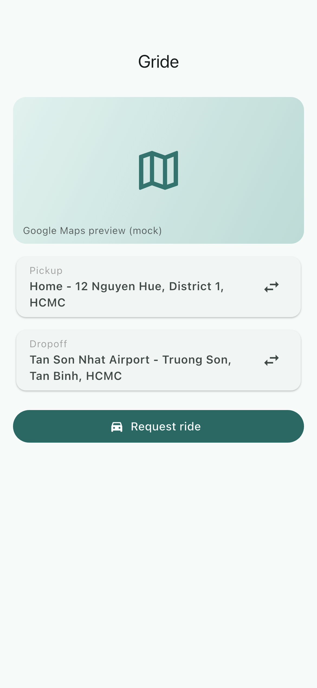
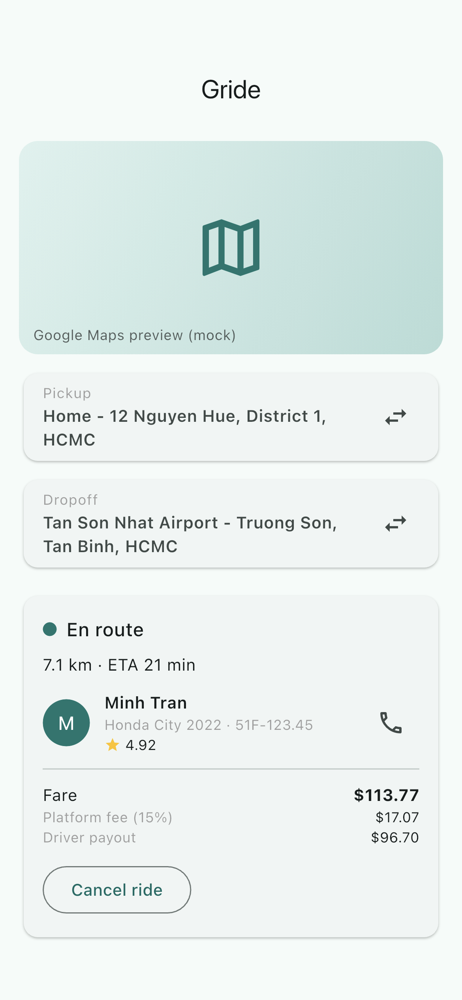
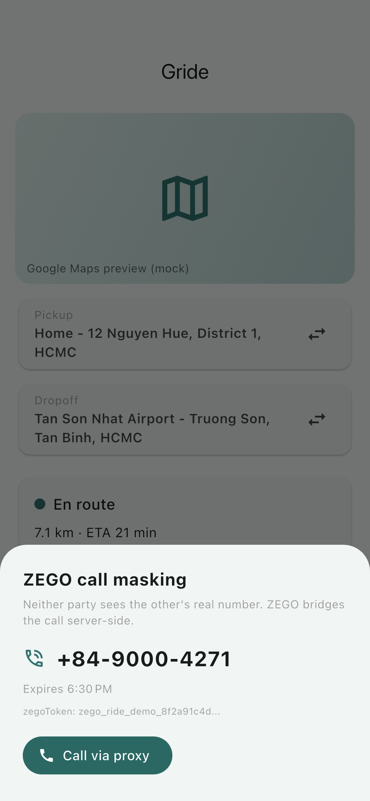
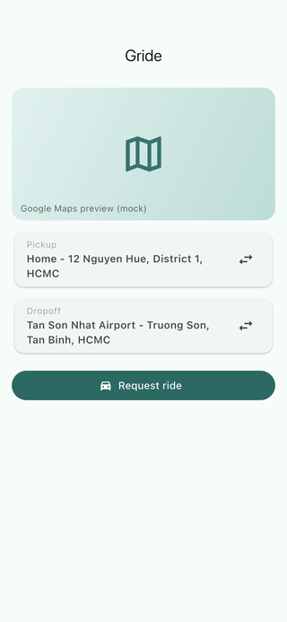

# flutter-zego-rideshare

Flutter POC for a ride-hailing / food delivery app with ZEGO Cloud call masking, Google Maps route preview, Stripe checkout split, and a driver-passenger ride state machine.

## Demo

Real iOS-Simulator captures from the running app (see [FLOW.md](FLOW.md) for how they were generated).

| Home | Active ride | ZEGO call mask |
| --- | --- | --- |
|  |  |  |



## What it shows

- Pickup + dropoff entry with mock Google Maps preview (route, distance, fare estimate).
- Ride request -> driver match -> en route -> arrived -> in progress -> completed state machine.
- ZEGO Cloud call masking abstraction: driver calls passenger without exposing either real number. Each ride generates an ephemeral `proxyNumber` + `zegoToken`; both parties dial the mask, ZEGO bridges the call server-side.
- Stripe payment summary: rider charge, platform fee (15%), driver payout, Apple Pay / Google Pay mock.
- Riverpod state for ride lifecycle, driver pool, and call session.

## Stack

- Flutter + Dart
- Riverpod for state management
- intl for currency / date formatting
- ZEGO Cloud Voice Call Kit concepts (call masking, proxy numbers, RoomKit token)
- Google Maps SDK concepts (Directions API, Geocoding, Polyline)
- Stripe Connect concepts (PaymentIntent split, driver Connect account)

## Run

```bash
flutter pub get
flutter run
```

The POC ships seeded mock data, no API keys required. For a real integration:

- ZEGO Cloud: enable Call Kit + Voice Call Masking on console, mint server tokens with App ID + ServerSecret, call `ZegoCall.callUser(targetUserID, callType)` from the masked UI.
- Google Maps: add `google_maps_flutter` + key in `AndroidManifest.xml` and `AppDelegate.swift`, call Directions API server-side to keep key off device.
- Stripe Connect: server creates `PaymentIntent` with `application_fee_amount` + `transfer_data.destination = acct_driver`.

## Backend sketch

```
POST /ride/request
  body: { pickup, dropoff, riderId }
  -> match nearest driver, return rideId, driverId, estimatedFare

POST /ride/{id}/call-mask
  -> zego.createMask({ caller, callee }) -> { proxyNumber, zegoToken, expiresAt }

POST /ride/{id}/charge
  -> stripe.paymentIntents.create({
       amount, currency,
       application_fee_amount: amount * 0.15,
       transfer_data: { destination: driver.stripeAccountId },
     })
```
